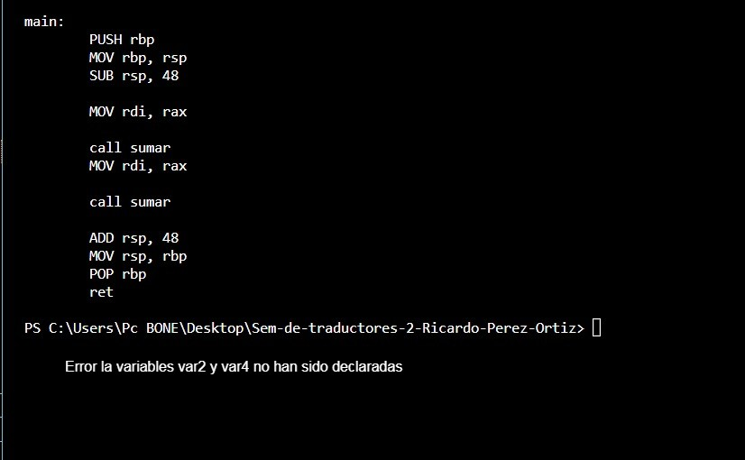

# Proyecto Final Generador de codigo

**Proyecto final**

Empezamos viendo el analizador lexico 

Vemos el arbol sintactico generado por la suma

Y aquí veremos el analizador semantico y el ensamblador que nos genero 

nos muestra el resultado de la suma

#Ruta alternativa

En la ruta alternativa no definimos los valores de la variables var2 y var 4 lo cual nos dara un error al final empezando con el analizador lexico donde no apareceran los valores

Continuando con el arbol donde tampoco tienen que aparecer los valores de las variables var2 y var 4

Continuando con el analizador semantico 

aquí nos mostrar nuestro error de sintaxis ya que no estan definidas

