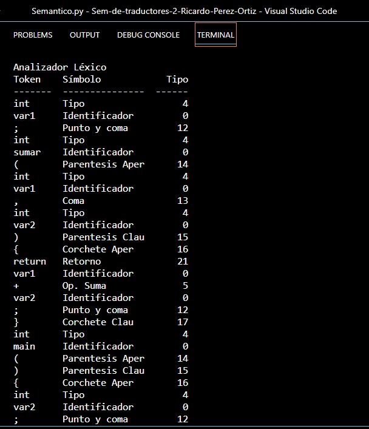
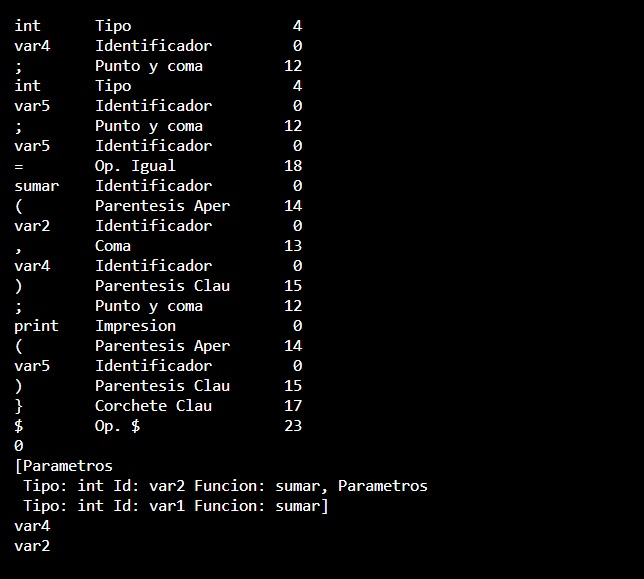
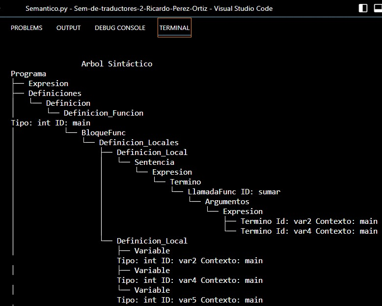
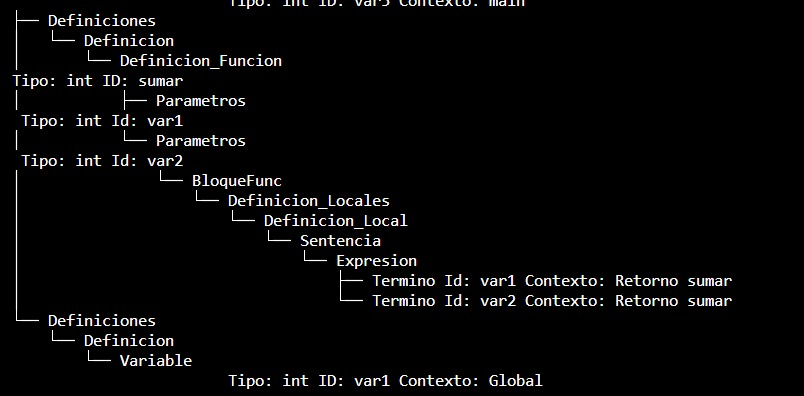
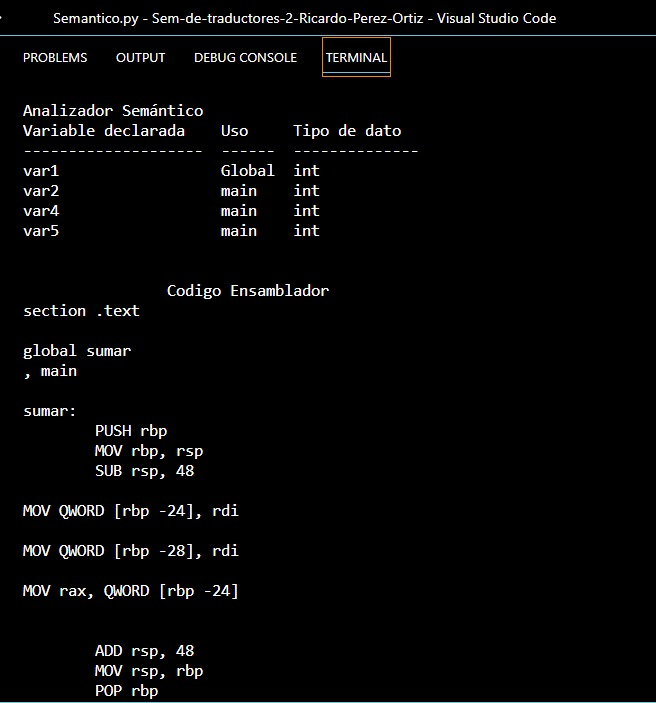

# Proyecto Final Generador de codigo

**Proyecto final**

Empezamos viendo el analizador lexico 

Vemos el arbol sintactico generado por la suma

Y aquí veremos el analizador semantico y el ensamblador que nos genero 

nos muestra el resultado de la suma

#Ruta alternativa

capturas/alternativa1.jpeg

